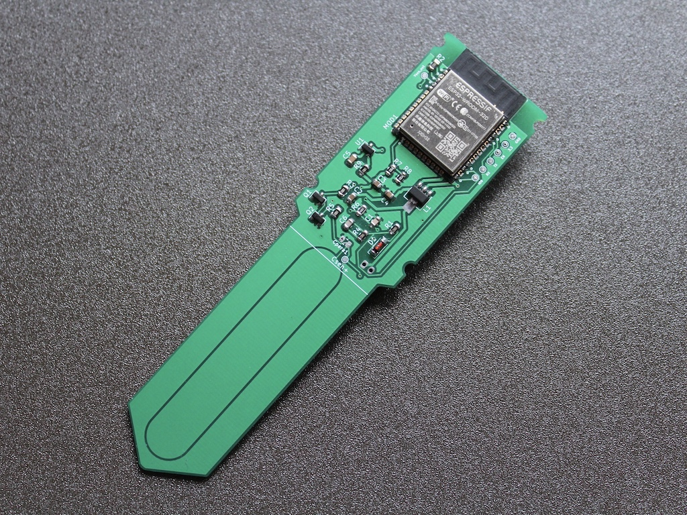
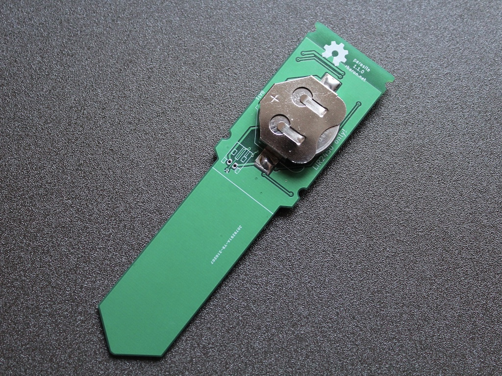
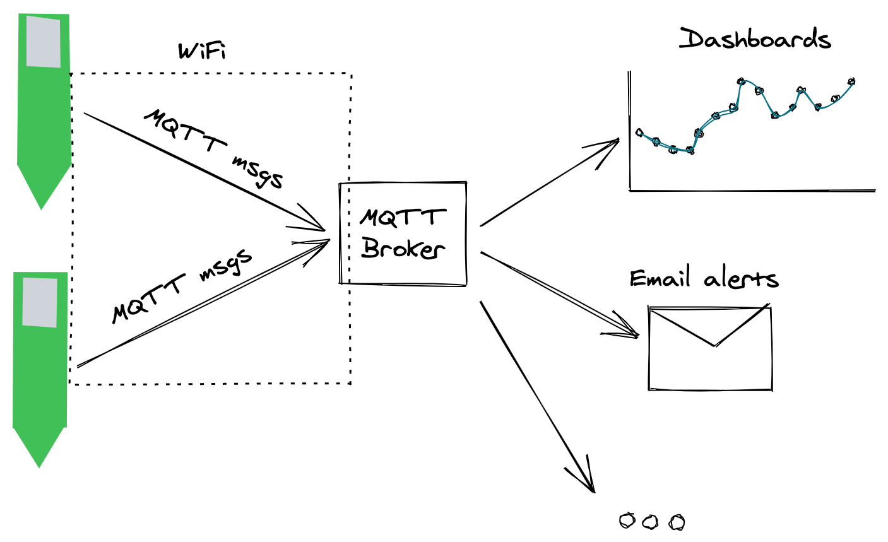
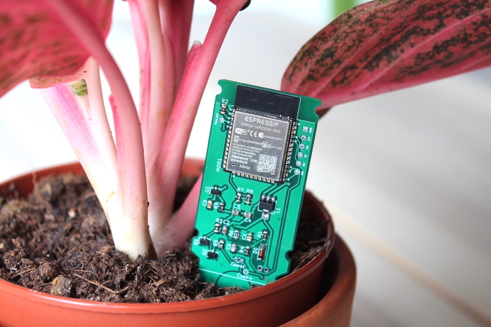
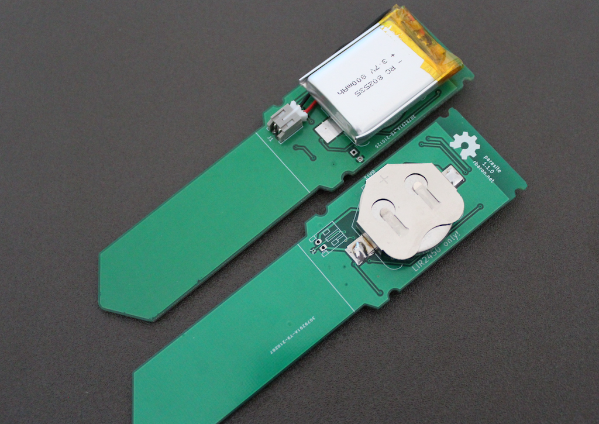

# w-parasite

w-parasite is an open source, WiFi-enabled soil moisture sensor for house plants.

This repo contains all the hardware design files (schematic, printed circuit board layout) and code for customizing and making your own w-parasite.

# How It Works

w-parasite works by reading the soil moisture level and transmitting that information via MQTT messages via WiFi. To save battery, the board sleeps most of the time, and only wakes up every few minutes, at which point it takes a reading and ships it to the MQTT broker.

An [ESP32](https://www.espressif.com/en/products/socs/esp32) sits at the heart of the board, and is responsible for managing the sensors and connecting to WiFi.

The board can be powered with LiPo/Li-Ion batteries. There is a battery clip for rechargeable LIR2450 batteries, as well as a possibility for soldering a JST connector for beefier LiPo/Li-Ion batteries.

# Moisture Sensor
To measure the soil moisture, two PCB traces act like a disguised capacitor. These are the two large copper traces on the bottom of the board, on the part that goes into the soil. The capacitance between these two traces vary according to the amount of water around them, and we exploit that phenomenom to infer the soil moisture.

[This great post](https://wemakethings.net/2012/09/26/capacitance_measurement/) on wemakethings goes into detail about the inner workings of capacitive soil moisture sensors. I also expanded a little bit on the topic it in [here](https://twitter.com/rbaron_/status/1367182806368071685).

# Repo Organization
* [`code/`](./code/): Software. It's an [arduino-esp32](https://github.com/espressif/arduino-esp32/) [PlatformIO](https://platformio.org/) project;
* [`kicad/`](./kicad/): Hardware. It's a [KiCad](https://kicad.org/) project with the electronics schematic, PCB layout & fabrication files;

# Battery Life
To estimate the battery life and discuss our choices, we can agree on a few premisses:
1. Soil moisture doesn't change abruptly (except when watered). It is okay to wait several minutes between readings.
2. Most of the time, the sensor will be in a low power mode ("deep sleep"), in which its CPU is not active and it's not connected to WiFi. The current consumption in this state can be brought to around 15uA (10uA for the ESP32 and around 6uA for the voltage regulator - LDO);
3. When the sensor is active, its current consumption is orders of magniture higher. WiFi and ESP32 are not usually a good choice for low power devices, but since we can get away with such long periods of deep sleep, we might just barely get away with it. When active, w-parasite can consume peaks of over 200mA. It is paramount that we keep the active time short - cutting it down from 2 seconds to 1 second essentially doubles the battery life.

I have experimented with two main types of battery:
- LIR2450 Li-Ion coin cells. They are super compact (as in the photo above). With around 120mAh, they can only source short peaks of 200mA, which is below what the ESP32 expects. Using them poses a challenge on capacity and current, and that's why we like it so much;
- LiPo/Li-Ion cells. They are generally a lot bigger but usually pack up to 3000mAh. They take a lot of space but comfortably powers w-parasite for well over a year;

I put together [this spreadsheet](https://docs.google.com/spreadsheets/d/1Lt3Obveo7YzpxWigAVeM2rHjrGED6iG8pZ1Y3q1cldg/edit#gid=0) to estimate battery life. Here are some example scenarios:
- LIR2450 cell (120mAh), transmitting every 30 minutes: around 80-90 days.
- 1200mAh LiPo, transmitting every 10 minutes: over a year;
- 18650 Li-Ion (e.g.: 2700mAh), transmitting every 5 minutes: over a year;

# Possible Improvements
Ideas for improvements go in the direction of battery saving by shaving off precious milliseconds during the active cycle:

* Use a static IP address, BSSID and static dns servers. This has the downside of being less plug-and-play, so we need to investigate if the savings in connection time are worth it;
* Reduce boot time. We can configure esp-idf to suppress boot logging. This will probably require re-compiling the SDK ourselves, as Arduino/PlatformIO uses a prebuilt binary. See [this Github doc](https://github.com/espressif/arduino-esp32/blob/master/docs/esp-idf_component.md). [This Reddit thread](https://www.reddit.com/r/esp32/comments/fnj51a/a_guide_to_improving_esp32_boot_speed/) also has valuable info. Major savings seem to come from:
  * Pulling GPIO15 down on reset. It disables UART output;
  * Set BOOTLOADER_LOG_LEVEL to NONE/ERRORS;
  * ESPTOOL_FLASHMODE: QIO if possible;
  * SPIRAM_MEMTEST: disable RAM test;
* Experiment with a 3.0V LDO (such as the HT7330). The ESP32 should be able to run with 3.0V (instead of the nominal 3.3V we're using here, which has a 0.9V dropout voltage, so we can only power it with at least 3.39V). This would make better use of the LIR2450 cell. From the [LIR2450 discharge curve](https://devzone.nordicsemi.com/cfs-file/__key/communityserver-discussions-components-files/4/1307.3.png), I don't think the gains are massive, but we could probably squeeze 10%-ish more out of the LIR2450;
* Tigther MQTT messages. We currently send out multiple MQTT messages. This makes it easy to work with on the other end, but we can probably do better to bring the runtime down;

# Why not Bluetooth Low Energy (BLE)?
Excellent question! With BLE, we can work with much lower currents, and we can power the board with even cheaper batteries like the ubiquitous CR2032. SoCs like the [nRF5](https://www.nordicsemi.com/Products/Low-power-short-range-wireless) family from Nordic are much better suited for ultra low power applications. They idle at less than 1uA and can transmit with ~5mA (compare with 100-200mA for the ESP32 + WiFi)! I believe they are a better fit for battery-powered, intermittent sensors like this one. Moreover, ESP32, _specially_ with WiFi is notoriously power hungry. Even if we implement all the tricks in the book, we won't likely match the power efficiency of BLE-only chips.

With all that out of the way, if we power this with a beefier LiPo/Li-Ion battery, we can hopefuly already run for over a year on a single charge, with the added advantage of having a simpler architechure and more friendly - the sensor talks directly to your MQTT broker. Additionally, BLE devices usually have a much lower range and often require bridges for integrating with the rest of our system.

# News & Updates
For the freshest w-parasite updates, follow [@rbaron_](https://twitter.com/rbaron_).

# License
The hardware and associated design files are released under the [Creative Commons CC BY-SA 4.0 license](https://creativecommons.org/licenses/by-sa/4.0/).
The code is released under the [MIT license](https://opensource.org/licenses/MIT).